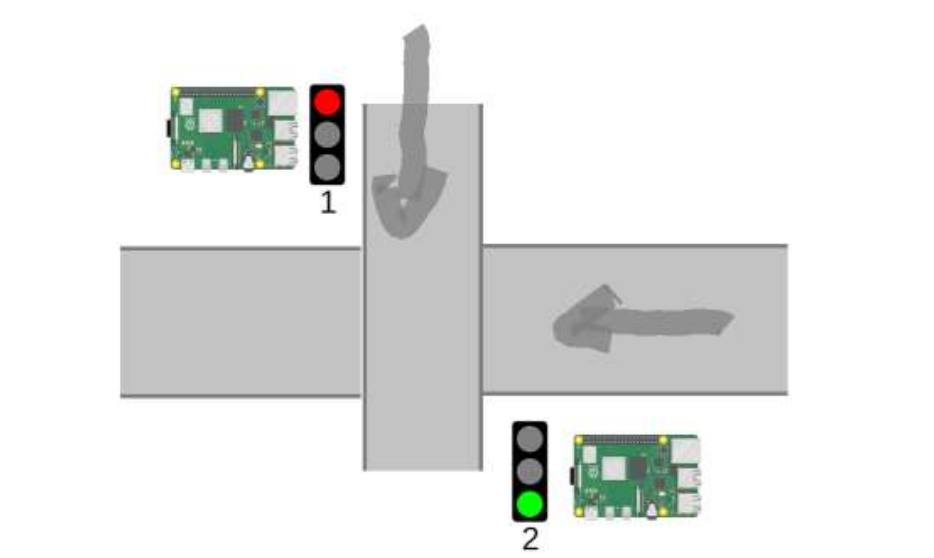
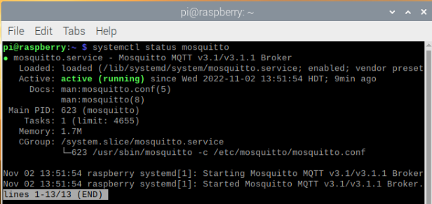
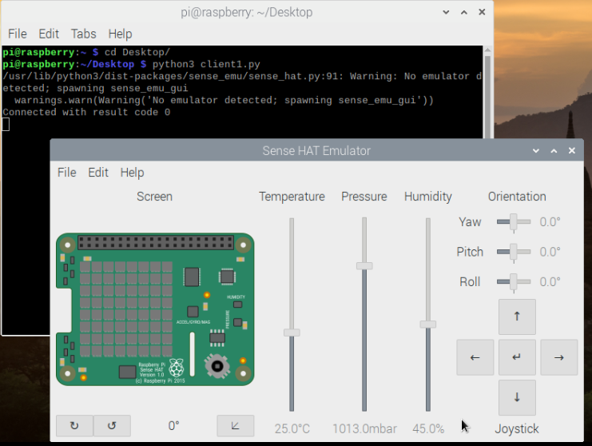
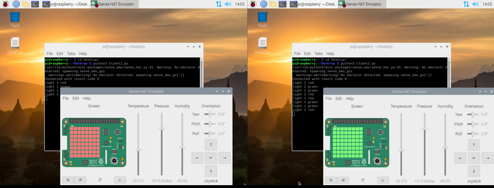

# paho-mqtt-communication

This small project is showing a basic usage of the paho library in python to enable the communication between 2 clients (both publisher and subscriber).

## What is it doing?

These scripts are synchronizing 2 light traffic controllers with raspberry Pi and using MQTT (M2M communication)

<p align="center">
  
</p>

We're using sense_emu package to manipule the Sence Hat Emulator (will display the ligth color) in raspbian (Raspberry Pi OS) so make sure to run this script in a raspbian OS (use a vm).

You can run each script in a seperate VM and our broker on a another VM.

## How to execute it?

The client1 should be the first script to run since it is listening and responding to the messages recieved from client2 and make sure that the mosquitto broker is running.

* Making sure mosquitto broker is running

<p align="center">
  
</p>

If you're mosquitto broker is inactive, make sure to start it before running the scripts
```
mosquitto -v
```

* Launching our first client script

<p align="center">
  
</p>


The first client is only listening to the messages coming to the topic "light1" and responding by publishing its message to the topic "light2".

* Launching the second client script
  


Once the client2.py script is executed, we can see that the 2 Sence Hat Emulators are switching lights every 3 seconds.
The client2 script is the one that will start the communication by publishing to the topic "light1", waiting 3 seconds, switching the light and republishing its light color.

The client1 is only interacting with the light changes by reading the message from "topic1". The response from client1 to client2 is not really needed by we're just informing the client2 whether the client1 switched the light to verify synchronization.

## About the authentication

We're using username/password authentication when connecting to the broker and this needs additional configuration in mosquitto broker. To disable this just delete the lines setting the credentials in the 2 clients.

The needed configuration is the mosquitto broker is quite simple and can be done using these commands
```
cd /etc/mosquitto/
# pass is the name of the file where the credentials will be saved and change the username by the name you want
sudo mosquitto.passwd -c /etc/mosquitto/pass username
```
Once the credentials are created, modify the config file to specify that we want credentials check when connnecting to the broker by adding this at the end of mosquitto.conf file
```
allow_anonymous false
password_file /etc/mosquitto/pass
```
Restart mosquitto and the credentials check configuration will be applied.